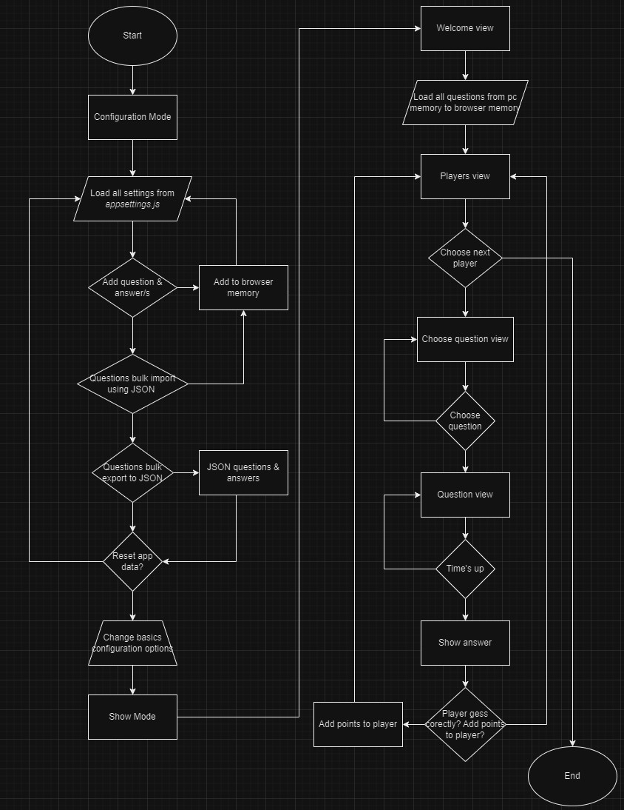
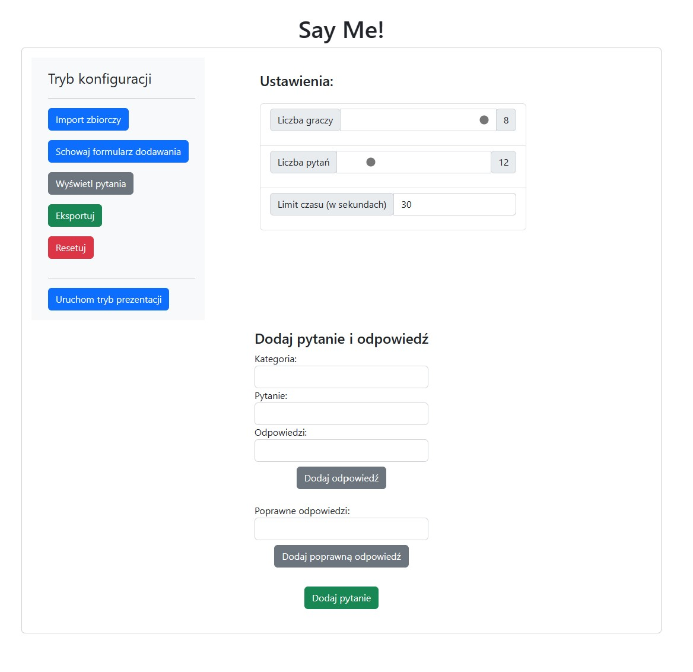
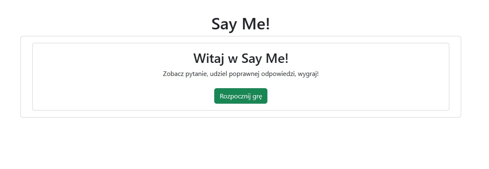
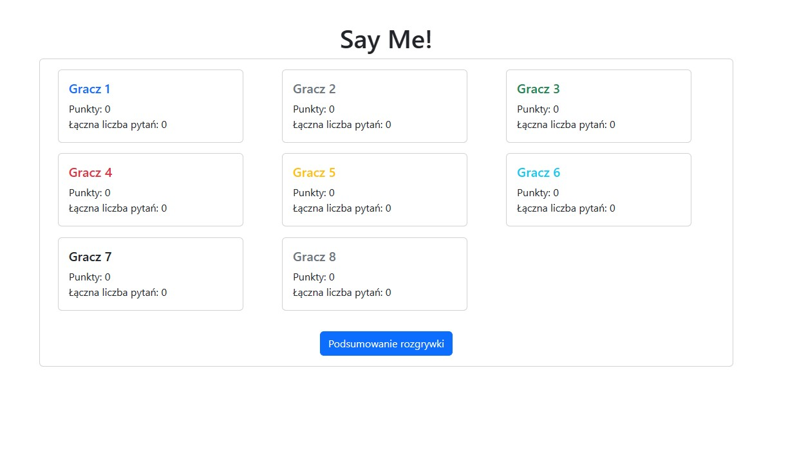
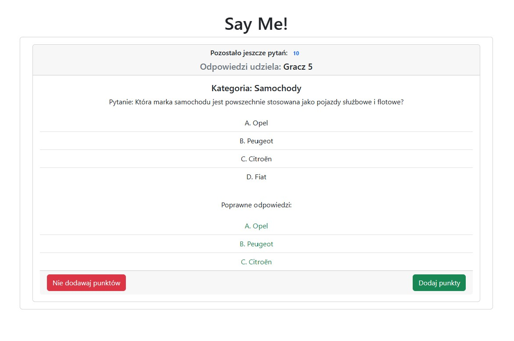
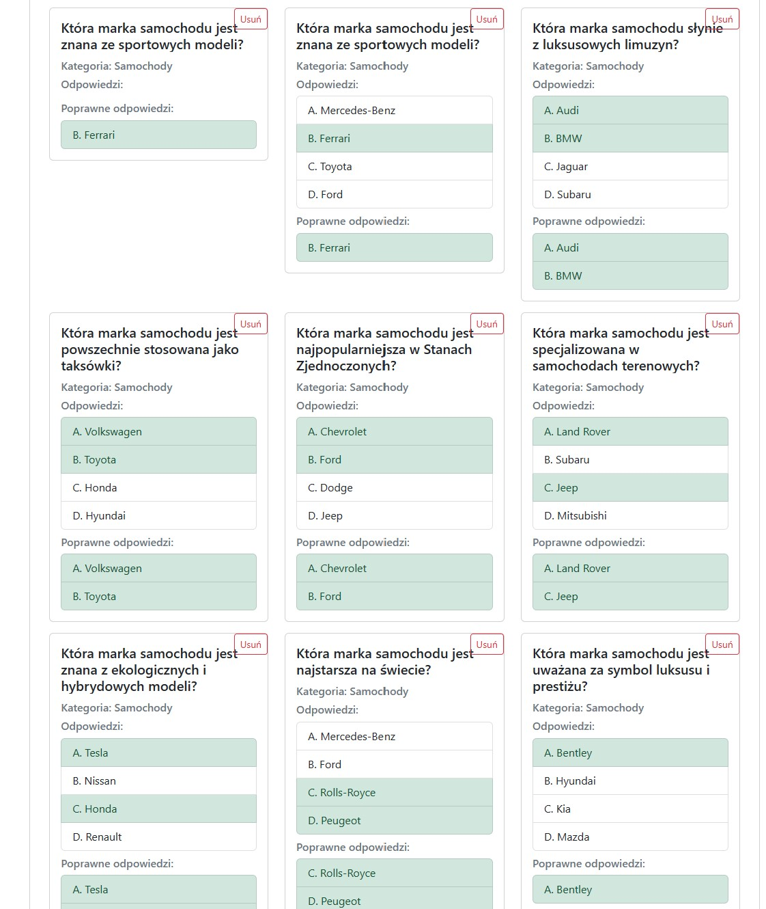

# SayMeQuizzApp

## General Description

[YouTube video](https://youtu.be/RChvJstqGJE)

The entertainment company SayMe has hired you to create a quiz application. The quiz will be launched and displayed in a browser, and the screen will be shared/broadcast on television.

The application will be entirely controlled by the show presenter (the sole user of the application) using a mouse. Players will never directly control/use the application.

The application should have two modes:

- Configuration Mode - for setting up the quiz before the show.
- Show Mode - for running the quiz.

## Presuppositions

### Configuration Mode

- During initialization, the application should automatically enter configuration mode. With basic options, the presenter should be able to change the main settings of the application via the GUI (e.g., number of players, number of questions, time per question, etc.).
- The application should load all additional detailed configuration settings (points per question, randomization of questions, display time of the welcome screen, etc.) from a separate JavaScript file named `appsettings.js`.
- The application's questions and answers should always be stored in the browser's memory. The application should not use a backend server database to load/save questions.
- Questions can be entered into the application using one of the following methods:
    - **Add Question and Answer** button.
    - **Bulk Import** text box allowing the presenter to copy and paste question and answer data in `JSON` format.
- The **Export** button should allow the presenter to export all questions and answers from the application's browser memory in `JSON` format.
- The **Reset** button should clear the entire browser memory of the application (questions and answers and any data related to the application).


### Show Mode

- The show mode should consist of **4** different screens:
- A _Splash_ Welcome Screen displayed upon starting Show Mode.
- A Player Screen, which shows the current points of each player and allows the presenter to select the next player.
- A Question Selection Screen, which allows the player to choose a question from the remaining unused questions.
- A Question Screen, which shows the question and the time remaining to answer it. After the time expires, the answer is displayed.
- Depending on the player's answer, the presenter will decide whether to award the player points for the question or not. (Remember: players always answer questions verbally. Players never have direct access to the application. Only the presenter controls the application.)

### Simplified Incomplete Flowchart of the Application



### Instructions

1. When creating the above application, remember that:
- The application should support a variable number of players (max. 8) and a variable number of questions (max. 64).
- The application should include at least 2 types of questions/answers. For example, questions and answers, multiple choice, fill-in-the-blank, guessing letters in a hidden word, etc.
2. From a technical standpoint, remember that:
- The application should be implemented using JavaScript in the form of a SPA (Single-Page Application).
- You can use any library or framework, such as React, Vue, Bootstrap, etc.
- The backend server can serve the application's HTML, JS, and CSS files, but all questions should be stored in the browser application's memory.
- Functionality that continuously saves the application's state. This will allow the presenter to continue from the last saved state before refreshing the browser (F5). The saved state can be loaded using the "Continue" button in Configuration Mode.
- A modest GUI is necessary.
3. Make appropriate assumptions as needed.

## First Usage

### Running the App

```
npm start
```

### Installation

```
npm install animate.css
```

## App Views






